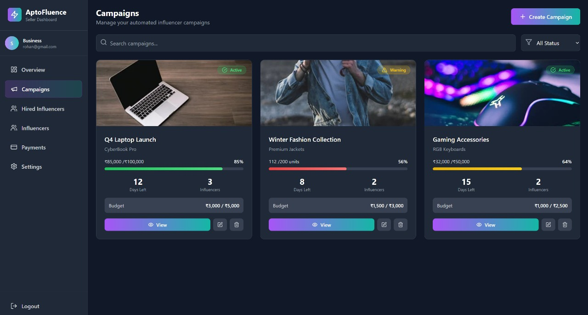
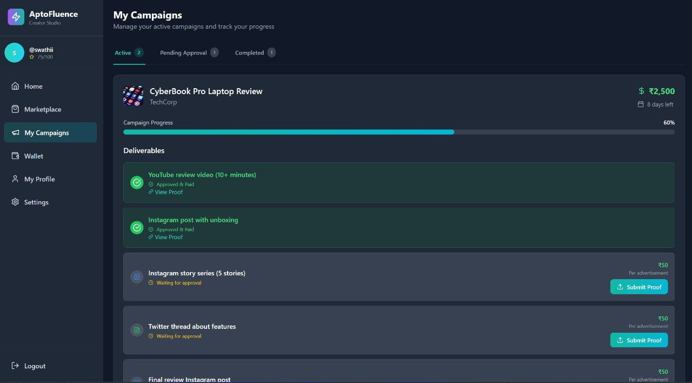
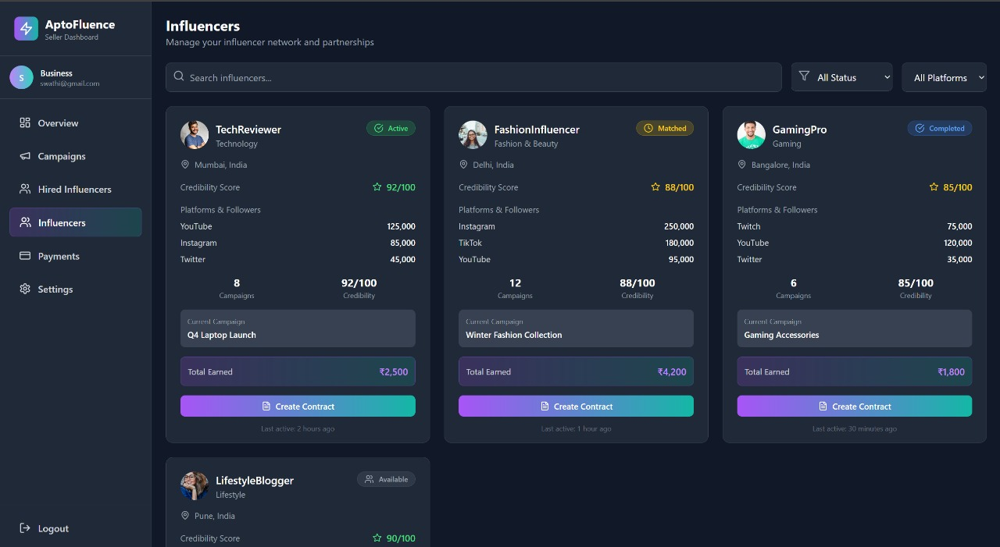

# 🚀 AptoFluence — Web3 Influencer Marketing on Aptos

*Automated, performance-based influencer marketing with transparent on-chain logic and reputation.*

AptoFluence lets **sellers** run performance-driven campaigns and **automatically engage the next best influencer** when KPIs slip—using **Aptos Move** smart contracts for events, rotation, and payout intents.

---

## 🌟 Key Features

### 🎯 Smart Contract Automation

* **Performance triggers:** If sales fall below configured thresholds (e.g., 10%, 20%), the contract emits events to **auto-rotate** to the next influencer.
* **Escrow intent & payouts:** Contracts emit `PayoutReleased` events; the treasury service executes transfers (upgradeable to full on-chain escrow).
* **Multi-tier escalation:** Define progressive thresholds to escalate influencer credibility.

### 💰 Transparent Pricing System

* **Influencer-set pricing** with platform-specific rates (Instagram / YouTube / X).
* **Minimum budget controls** and per-ad pricing tiers.

### 🤝 Contract Management

* **Proposals & milestones:** Clear deliverables, timelines, and payment structure.
* **Proof-based payments:** Release only after approved deliverables.
* **Credibility scoring:** Reputation improves with verified performance.

### 🔐 Blockchain Security

* **Aptos Move** for deterministic logic and resource safety.
* **Account/wallet–based** actions.
* **Event-driven automation** for reassign & payouts.

---


### 📸 Screenshots

### Seller Dashboard


### Influencer Marketplace


### Contract Management


### Campaign Analytics


### Payout & Escrow Flow



---

## 🏗️ Architecture

```
React Frontend (Seller + Influencer UI)
        │
        ▼
Backend API (Node/TS, Express)
  • /campaigns, /sales, /influencers
  • Telegram/Discord notifications
  • Treasury (APT transfers)
        │        ▲
        │ Events │
        ▼        │
Aptos Move Contracts  ──► Events: SaleRecorded / ReassignNeeded / InfluencerAssigned / PayoutReleased
  • Campaigns (KPI, windows, thresholds, rotation)
  • Influencer registry (credibility, pricing)
  • Payout intent via events
```

**Event flow:**
`record_sale` → `evaluate_and_maybe_reassign` → **ReassignNeeded** → next influencer notified → `finalize_and_payout` → **PayoutReleased** → treasury pays.

---

## 🔏 Smart Contracts

**Module:** `influencer_mkt.move` (Aptos Move)

**Core Resources**

* `Registry`: Influencer profiles (`credibility`, `followers`, `category`, `pricing`, `active`).
* `Campaign`: Seller KPI target, time window per influencer, thresholds, ranked influencer addresses, per-influencer sales, status.

**Events**

* `SaleRecorded(campaign_id, influencer, amount)`
* `InfluencerAssigned(campaign_id, influencer)`
* `ReassignNeeded(campaign_id, next_influencer)`
* `PayoutReleased(campaign_id, influencer, amount, reason)`

**Behavior**

* Create campaign → assign `influencers[0]` and start the window.
* Record sales → attribute to current influencer.
* Evaluate window → if under target, rotate to next influencer and emit events.
* Finalize → emit payout intent (`base` ± `bonus`) and close.

---

## 📡 API (Frontend → Backend)

### Influencers

```http
POST /influencers/register
Content-Type: application/json
```

```json
{
  "addr": "0xINFL...",
  "contact": "@handle",
  "category": "Instagram",
  "followers": 150000,
  "location": "IN",
  "base_price": 50000,
  "credibility": 85
}
```

### Campaigns

```http
POST /campaigns
Content-Type: application/json
```

```json
{
  "merchant_addr": "0xMERCHANT",
  "title": "Concert X",
  "description": "City launch",
  "image": "",
  "kpi_target": 50,
  "window_secs": 86400,
  "base_fee": 50000,
  "bonus_fee": 25000,
  "budget_hint": 100000,
  "thresholds": [10, 20],
  "influencers": ["0xINFL1", "0xINFL2"]
}
```

```http
POST /campaigns/:id/evaluate
POST /campaigns/:id/finalize
```


---

## 👥 Workflows

### 🏢 Sellers (Businesses)

1. **Create campaign:** KPI target, window, thresholds, ranked influencers.
2. **Fund treasury** (devnet faucet for demos / test environments).
3. **Checkout hook** calls `/sales` after each successful purchase.
4. **Evaluate** periodically (cron or button); auto-rotation on underperformance.
5. **Finalize** to emit payout intent; treasury transfers funds.

### 🎤 Influencers (Creators)

1. **Register profile** with pricing, platforms, minimum budgets.
2. **Receive offers** when rotation events fire (or manual invite).
3. **Deliver proofs** and track milestones.
4. **Get paid** upon `PayoutReleased` → treasury executes transfer.
